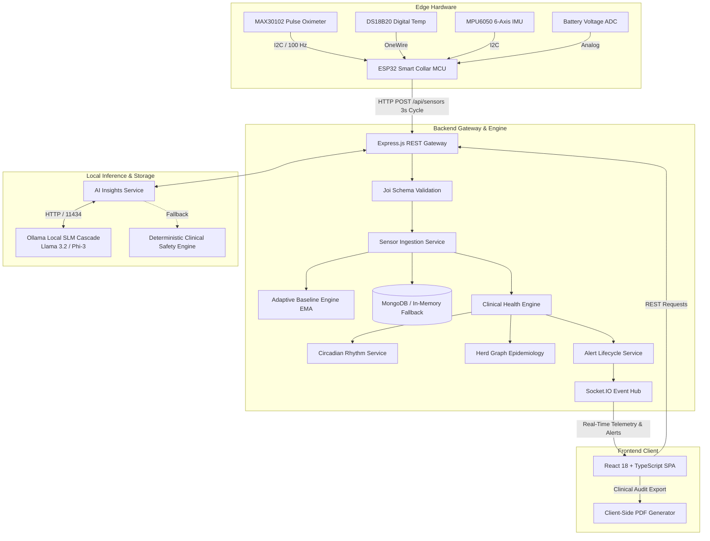
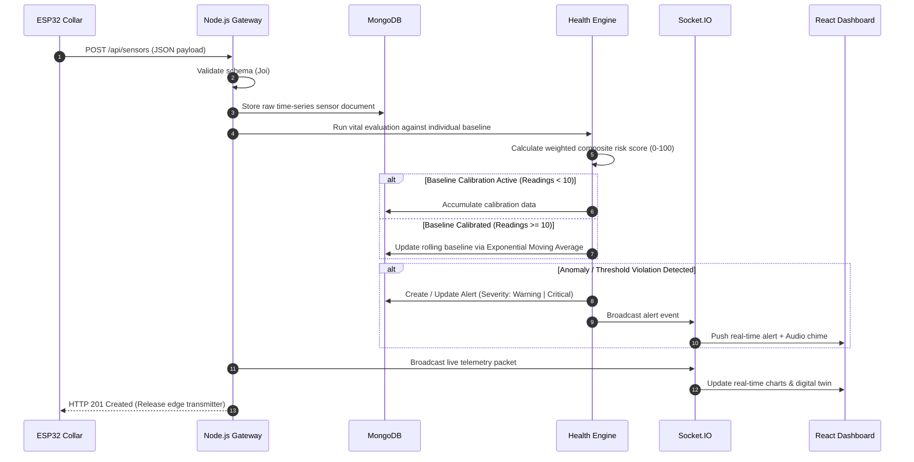
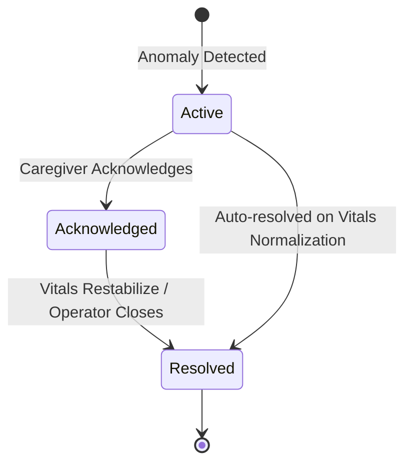

# M.A.V.I.S. (Multi-Modal Animal Vitality Intelligence System)

M.A.V.I.S. is an end-to-end, on-premises Internet of Things (IoT) and clinical telemetry platform designed for continuous monitoring of animal and livestock health. The system captures streaming biometric and environmental data from ESP32-based smart collars, executes real-time multi-modal vital evaluations, maintains adaptive individual baselines, coordinates alert lifecycles, and synthesizes localized clinical assessments via on-device Small Language Models (SLMs) with zero cloud dependency.

---

## System Architecture

The platform is structured into three primary tiers: Edge Hardware, Local Gateway Backend, and Client Dashboard.



---

## Telemetry Ingestion & Evaluation Pipeline

The sequence below illustrates the lifecycle of a sensor transmission from hardware sampling to client dashboard rendering.



---

## Core Capabilities

### 1. Edge Hardware & Sensor Ingestion
- **Sampling & Smoothing**: High-frequency sampling (100 Hz MAX30102 PPG) with non-blocking event loops, 10-point moving average temperature smoothing, and motion detection.
- **Transmission Cycle**: Structured JSON payload sent every 3 seconds over Wi-Fi / HTTP POST.
- **Power Efficiency**: Instant acknowledgment response enables low-power radio duty cycles.

### 2. Adaptive Baseline & Clinical Health Engine
- **Per-Subject Calibration**: Tracks individual baseline averages over an initial 10-reading calibration window.
- **Dynamic EMA Learning**: After calibration, updates resting baselines dynamically using Exponential Moving Average ($\alpha = 0.05$).
- **Circadian Rhythm Normalization**: Adjusts core body temperature and heart rate evaluations according to diurnal time-of-day cycles.
- **Herd Graph Epidemiology**: Monitors correlated febrile spikes across subjects to detect contagious herd outbreak waves.
- **Multi-Species Thresholds**: Species-specific decision matrices for Bovine (cattle), Canine (dogs), and Feline (cats).

### 3. Local-First AI Inference (100% On-Premises)
- **Local SLM Cascade**: Queries local Ollama inference server (`127.0.0.1:11434`) using model priority:
  1. `llama3.2:3b` / `llama3.2:1b`
  2. `phi3:mini` / `phi3`
  3. `gemma2:2b` / `qwen2.5:3b` / `mistral`
- **Zero-Cloud Fallback**: If local LLM runtimes are unavailable, automatically falls back to an in-memory **Deterministic Clinical Safety Engine**.
- **Clinical Prompts**: Veterinary prompts produce plain-language diagnostic summaries, differential considerations, and actionable directives.

### 4. Alert Lifecycle State Machine
- **State Progression**: `active` &rarr; `acknowledged` &rarr; `resolved`.
- **Deduplication**: Suppresses redundant alert spam by updating existing active alerts instead of generating duplicates.



### 5. Client Dashboard & Clinical Tools
- **Live Telemetry & Digital Twin**: Real-time vital metrics, posture indicators, and interactive 24-hour historical trend charts (Recharts).
- **Role-Based Access**: Role switching between Caregiver (`User`) and Infrastructure (`Admin`) modes.
- **Veterinary PDF Reports**: 2-page clinical audit report generator with vital summaries, range analysis, and print-ready formatting (`jspdf` / `html2canvas`).
- **Telemetry Scenario Studio**: Built-in scenario injection suite (Calibration, Homeostasis, Tachypnea, Hyperthermia, Herd Outbreak, Low Battery).

---

## Repository Structure

```text
MAVIS/
├── backend/
│   ├── config/               # Database connection and runtime constants
│   ├── features/
│   │   ├── ai-insights/      # Ollama SLM cascade and clinical fallback engine
│   │   ├── alerts/           # Alert repository, controller, and lifecycle service
│   │   ├── animals/          # Animal profiles, baseline storage, and status aggregation
│   │   ├── auth/             # JWT auth routes, bcrypt hashing, and User model
│   │   ├── health-engine/    # Multi-modal evaluators, circadian service, and herd graph
│   │   ├── sensors/          # Ingestion pipeline, Joi validation, and time-series model
│   │   └── simulation/       # Autonomous TelemetryDaemon background service
│   ├── middlewares/          # Global error handler and authentication middleware
│   ├── scripts/              # Verification suites and scenario simulation runners
│   ├── utils/                # Standardized AppError and Winston logger
│   ├── Dockerfile            # Container definition for backend gateway
│   └── server.js             # Express server entry point and Socket.IO wiring
├── frontend/
│   ├── public/               # Favicon and logo assets
│   ├── src/
│   │   ├── features/
│   │   │   ├── admin/        # Admin command overview and hardware diagnostics
│   │   │   ├── alerts/       # Alert center and emergency dispatch modal
│   │   │   ├── analytics/    # Multi-species correlation charts and distributions
│   │   │   ├── animals/      # Animal registry and 24h VitalsModal
│   │   │   ├── auth/         # Authentication views and user profile modal
│   │   │   ├── dashboard/    # User telemetry dashboard overview
│   │   │   ├── digital-twin/ # Biological digital twin monitor and AI Copilot card
│   │   │   ├── geofence/     # GPS perimeter guard component
│   │   │   ├── landing/      # Product landing page with live interactive demo
│   │   │   ├── reports/      # Veterinary audit PDF modal generator
│   │   │   └── simulation/   # Scenario simulation studio
│   │   ├── shared/           # Reusable components, Toast context, API client, types
│   │   ├── App.tsx           # Route layout and Socket.IO connection manager
│   │   └── index.css         # Tailwind tokens and clinical theme styles
│   └── package.json
├── hardware/
│   └── esp32_collar/
│       └── esp32_collar.ino  # Production ESP32 firmware for MAX30102, DS18B20, MPU6050
├── docker-compose.yml        # Multi-container deployment specification
└── README.md
```

---

## API Reference

All requests and responses use JSON format. Failed requests return standardized error payloads: `{ "status": "fail", "message": "<reason>" }`.

### Animals

| Method | Endpoint | Description |
|---|---|---|
| `POST` | `/api/animals` | Register a new animal subject |
| `GET` | `/api/animals` | Retrieve all registered animals |
| `GET` | `/api/animals/:id` | Fetch animal profile by ID |
| `PATCH` | `/api/animals/:id` | Update animal profile details |
| `DELETE` | `/api/animals/:id` | Remove animal record |
| `GET` | `/api/animals/:id/health` | Compute real-time health aggregation |

### Sensor Telemetry

| Method | Endpoint | Description |
|---|---|---|
| `POST` | `/api/sensors` | Ingest sensor data packet |
| `GET` | `/api/sensors/latest/:animalId` | Fetch latest sensor reading |
| `GET` | `/api/sensors/history/:animalId` | Query time-series telemetry (`from`, `to`) |

### Alerts

| Method | Endpoint | Description |
|---|---|---|
| `GET` | `/api/alerts/active` | Fetch all unresolved alerts |
| `GET` | `/api/alerts/animal/:animalId` | Fetch alert history for specific subject |
| `PATCH` | `/api/alerts/:alertId/status` | Mutate alert status (`active`, `acknowledged`, `resolved`) |

### Clinical AI Insights

| Method | Endpoint | Description |
|---|---|---|
| `GET` | `/api/ai/:animalId` | Generate on-demand clinical assessment for subject |

### Authentication

| Method | Endpoint | Description |
|---|---|---|
| `POST` | `/api/auth/register` | Create user or admin account |
| `POST` | `/api/auth/login` | Authenticate and obtain JWT token |
| `GET` | `/api/auth/me` | Fetch authenticated user profile |
| `PATCH` | `/api/auth/settings` | Update user notification/collar settings |

---

## WebSocket Events (Socket.IO)

The backend broadcasts real-time events over WebSocket at `ws://localhost:5000`:

| Event Name | Direction | Description |
|---|---|---|
| `sensor:update` | Server &rarr; Client | Real-time vital metrics packet broadcast every 3 seconds |
| `alert` | Server &rarr; Client | Anomaly or threshold violation alert notification |
| `alert:updated` | Server &rarr; Client | Alert status mutation (acknowledged or resolved) |
| `animal:created` | Server &rarr; Client | New subject profile registered on mesh |

---

## Getting Started

### Prerequisites
- **Node.js**: `v18.0.0` or higher
- **npm**: `v9.0.0` or higher
- *(Optional)* **Ollama**: For local SLM inference (`llama3.2`, `phi3`)
- *(Optional)* **Docker & Docker Compose**: For containerized deployment

---

### Method 1: Local Development Run (Recommended)

#### 1. Clone the repository
```bash
git clone https://github.com/Dheemanth07/M.A.V.I.S.git
cd M.A.V.I.S
```

#### 2. Start Backend
```bash
cd backend
npm install
npm run dev
```

> **Database Note**: The backend connects to MongoDB if available via `MONGO_URI` (or `mongodb://127.0.0.1:27017/mavis`). If no MongoDB instance is running, it automatically starts an **in-memory MongoDB database** with zero extra setup required.

#### 3. Start Frontend (in a separate terminal)
```bash
cd frontend
npm install
npm run dev
```

#### 4. Access the Application
Open [http://localhost:5173](http://localhost:5173) in your browser.

---

### Method 2: Docker Compose Deployment

To deploy all services using Docker:

```bash
docker compose up --build
```

---

## Hardware Configuration & Pinout

The collar firmware runs on standard ESP32 development boards with the following pin assignments:

| Sensor Module | Function | ESP32 Pin | Interface |
|---|---|---|---|
| **MAX30102** | PPG Heart Rate & SpO2 | SDA (GPIO 21), SCL (GPIO 22) | I2C (100 Hz) |
| **DS18B20** | Subcutaneous Body Temp | Data (GPIO 4) + 4.7kΩ Pull-up | OneWire |
| **MPU6050** | 3-Axis Accelerometer / Gyro | SDA (GPIO 21), SCL (GPIO 22) | I2C |
| **Voltage Divider** | Battery Depletion Monitor | ADC (GPIO 34) | Analog IN |

### Firmware Deployment
1. Open `hardware/esp32_collar/esp32_collar.ino` in the Arduino IDE.
2. Install required libraries: `SparkFun MAX3010x`, `DallasTemperature`, `OneWire`, `Adafruit MPU6050`, `ArduinoJson`.
3. Configure Wi-Fi SSID, password, and gateway IP address in the configuration block.
4. Flash to the ESP32 board over USB.

---

## Verification & Scenario Simulation

To verify all system subsystems and test anomaly handling without physical hardware attached, run the automated scenario runner:

```bash
cd backend
node scripts/simulate_all_scenarios.js
```

This suite sequentially tests:
1. **10-Step Baseline Calibration Stream** (locking in individualized baselines)
2. **Healthy Homeostasis Transmission** (verifying zero false alerts)
3. **Acute Respiratory Distress Injection** (SpO2 drop, tachypnea alert trigger)
4. **Thermal Hyperthermia Overload** (41.6°C febrile alert trigger)
5. **Multi-Subject Correlated Herd Outbreak Wave** (cluster contagion detection)
6. **Hardware Low Battery Warning** (<15% supply threshold)

---

## License

This project is licensed under the terms of the **MIT License**.
